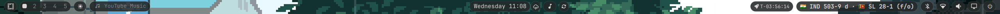

# Pillcycle Bar

A [Omarchy](https://omarchy.org/) shell bar replacement that cycles between three looks by double-clicking empty bar space: solid stock strip → transparent stock strip → floating pills.

Forked from [fab's Pillbar](https://github.com/fillmefab4/Pillbar) (MIT). The pills rendering is unchanged; this fork adds a mode cycle on top.



## What it does

- **3-state cycle**: double-click empty bar space (same gesture stock uses for transparency) to cycle `solid` → `transparent` → `pills`. Persisted as `bar.mode` in `shell.json`, so it survives restarts.
- **Pills mode**: each widget gets its own capsule background; the bar strip itself is never painted, so your wallpaper shows through between widgets.
- **Transparent mode**: stock transparent strip (floating text, wallpaper-contrast foreground).
- **Solid mode**: stock solid strip, honoring your `transparent` flag.
- **Zero layout changes**: your `shell.json` bar layout, widget order, center anchor, and installed plugins are used as-is.
- **Opt out per widget**: add `"pill": false` to any widget entry in `shell.json` to leave that widget unpilled in pills mode.
- **Everything else keeps working**: drag-to-reorder, drag-to-move the bar edge, tooltips, panel popouts, tray pinning, multi-monitor, vertical bars, and `SUPER+SHIFT+SPACE` hide all behave like stock.

## Install

```bash
omarchy plugin add https://github.com/<you>/pillcycle.git --enable
```

Restart the shell if the bar does not switch over immediately:

```bash
omarchy restart shell
```

## Uninstall

```bash
omarchy plugin remove villenull.pillcycle
```

This restores the stock Omarchy bar.

## Requirements

- Omarchy Quattro (or newer) with the Quickshell-based shell.

## How it works

`Bar.qml` extends the Pillbar engine: `barMode` (`solid`/`transparent`/`pills`) drives the strip color and the per-widget capsule visibility. Solid/transparent reuse the stock transparency machinery (including the wallpaper-contrast foreground swap); pills forces the transparent strip with opaque capsules and theme foreground. The pure cycle logic (`nextBarMode`) lives in `BarModel.js` and is unit-tested.

## Development

```bash
# Validate the manifest against the Omarchy plugin schema
omarchy plugin validate ~/.config/omarchy/plugins/villenull.pillcycle

# Run the BarModel.js unit tests (node)
node tests/bar-model.test.js
```

The plugin hot-reloads while editing under `~/.config/omarchy/plugins/villenull.pillcycle/`.

## License

[MIT](LICENSE) — Pillbar © 2026 fab, cycle mode © 2026 villenull. See LICENSE for both notices.
